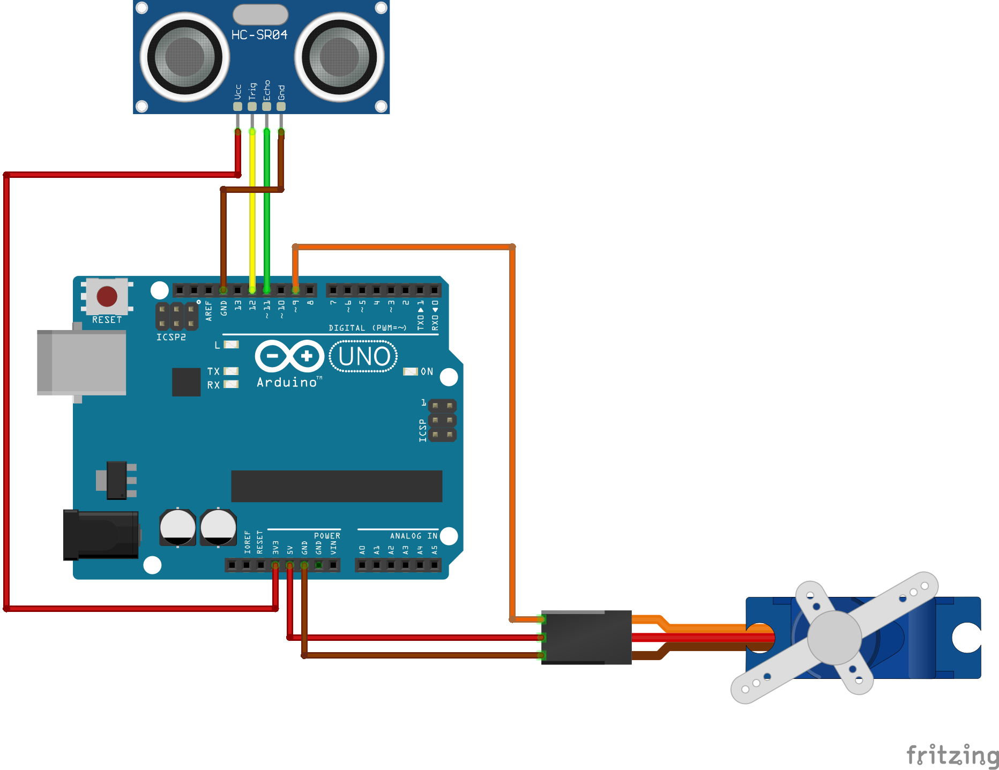
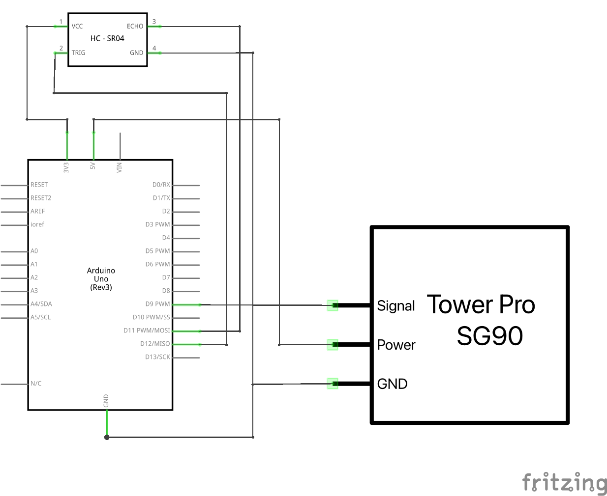

# Arduino Radar Project

This project implements a radar system using Arduino, a web server, and a browser-based visualization.

> ▶ Watch Full Demo Video
> [Near View](https://drive.google.com/file/d/1RLs03wlpeaNTwjk6VNf9T1w8mKSTP_-Q/view)
> [Far View](https://drive.google.com/file/d/1eQOlattvHD124RTTWSIaN7CsMJj24V4R/view)

## Components

1. Arduino sketch (`arduino-radar.ino`)
2. Node.js server (`index.js`)
3. Frontend visualization (`script.js`)

## Hardware

- Arduino board (e.g., Arduino Uno)
- Servo motor (SG90)
- Ultrasonic sensor (HC-SR04)
- Jumper wires (also known as Dupont lines)
- Breadboard (optional)
- External power supply (if using multiple servos)

## Arduino Sketch

The Arduino sketch controls a servo (SG90) and an ultrasonic sensor (HC-SR04) to create a scanning radar effect.

### Breadboard Diagram

### Wiring Diagram

### Key Features:

- Uses NewPing and Servo libraries
- Implements distance filters (SMA & EMA) to reduce noise
- Scans from 15° to 165°
- Uses non-blocking delay for smoother operation

### Important Safety Note:

1. Servo Motor Angle Limitation: The servo's rotation is intentionally limited to a range of 15° to 165°. This restriction is crucial for several reasons:

- It prevents potential gear damage in the SG90 servo.
- It significantly reduces the risk of motor burnout.
- It ensures smoother operation and extends the lifespan of the servo.

Modifying these angle limits is not recommended, as it may lead to hardware failure or reduced project longevity.

2. Power Management for Multiple Servo Motors: If you plan to use more than one servo in your project, it's crucial to connect an additional external power supply. This is because:

- Multiple servos can draw more current than the Arduino board can safely supply.
- Insufficient power can lead to erratic behavior of the servos or damage to the Arduino board.
- An external power supply ensures stable operation and prevents potential voltage drops.

When using an external power supply:

- Make sure it matches the voltage requirements of your servos (usually 5V for SG90).
- Connect the ground of the external power supply to the Arduino's ground.
- Use appropriate capacitors to smooth out any power fluctuations.

## Node.js Server

The server acts as a bridge between the Arduino and the frontend visualization.

### Key Features:

- Uses [Express.js](https://expressjs.com), [Socket.IO](https://socket.io) and [SerialPort.IO](https://serialport.io)
- Reads data from the Arduino then broadcasts to connected clients

## Frontend Visualization

The frontend creates a dynamic radar visualization using [D3.js](https://d3js.org) and [Socket.IO](https://socket.io).

### Key Features:

- Draws a radar display with concentric circles and radial lines
- Updates in real-time data from the Arduino
- Displays bearing, range, and time information

## Setup and Running

1. Connect the hardware:

- Connect the SG90 servo to the Arduino (signal wire to pin 9)
- Connect the HC-SR04 sensor to the Arduino (TRIG to pin 12, ECHO to pin 11)
- If using multiple servos, connect them to an external power supply

2. Upload the Arduino sketch to your Arduino board.
3. Install Node.js dependencies: `npm install`
4. Adjust the serial port in `index.js` to match your system.
5. Run the Node.js server: `node index.js`
6. Open the HTML file in a web browser to view the radar visualization.

## Notes

- Ensure all components are properly connected and powered.
- The radar scan speed and other parameters can be adjusted in the Arduino sketch.
- The visualization can be customized by modifying the D3.js code in `script.js`.
- Remember to respect the servo motor's angle limitations for optimal performance and longevity.
